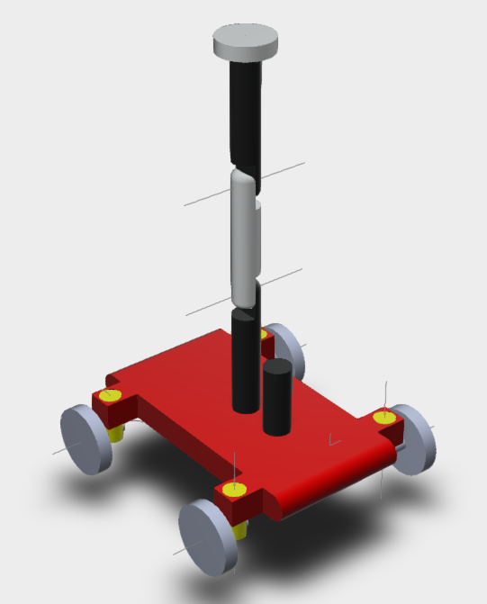

# SARB – Search and Rescue Bot  
*A Mobile Manipulator for Survey & Rescue Operations*  

## 📌 Overview
SARB (Survey and Rescue Bot) is a custom-designed mobile manipulator platform developed for search-and-rescue and environmental surveying tasks.  
It integrates:
- A **4-wheel mobile base**
- A **3-DOF articulated manipulator (RRR configuration)**
- An **Intel RealSense Depth Camera**
- A **2D LiDAR**
- A **Vacuum gripper** end-effector

SARB can navigate cluttered environments, pick up emergency beacons, and perform basic manipulation tasks using its robust kinematic model.

---

## 📸 CAD Model



---

## 🦾 Robot Architecture

### Mobile Base
- 4-wheel platform  
- Front wheels independently steer  
- Rear wheels provide drive  
- Integrated odometry via ROS2

### Manipulator Arm
- 3 DOF (Revolute–Revolute–Revolute)  
- Shoulder–Elbow–Wrist configuration  
- Vacuum gripper  
- DH-model-based FK & IK

---

## 📐 D–H Parameters

| Link | a (m) | d (m) | α | θ |
|------|------|-------|----|----|
| 1 → 2 | 0 | 0.092 | 0 | θ₁ + π |
| 2 → 3 | 0.08 | 0 | 0 | θ₂ |
| 3 → 4 | 0.092 | 0 | 0 | θ₃ |


---

## 🧮 Kinematics

### Forward Kinematics
- Mobile base FK uses wheel angular velocity + yaw orientation  
- Manipulator FK derived using homogeneous transformation matrices  

Example FK code:
```python
def homo_matrix(a, d, alpha, theta):
    return sp.Matrix([
        [sp.cos(theta), -sp.sin(theta)*sp.cos(alpha),  sp.sin(theta)*sp.sin(alpha), a*sp.cos(theta)],
        [sp.sin(theta),  sp.cos(theta)*sp.cos(alpha), -sp.cos(theta)*sp.sin(alpha), a*sp.sin(theta)],
        [0,              sp.sin(alpha),               sp.cos(alpha),              d],
        [0, 0, 0, 1]
    ])
```

### Inverse Kinematics
- Jacobian-based differential IK  
- Validated through Python script & ROS2–Gazebo simulation  

---

## 🎥 Simulation Videos

### Inverse Kinematics Motion  
🔗 https://www.youtube.com/watch?v=TTmBDSYedSo

### Mobile Base Goal Navigation  
🔗 https://www.youtube.com/watch?v=B1DWkmJjCEA

### Pick and Place  
🔗 https://youtu.be/s4FvZ7kkXAc

---

## 🌐 Workspace Study

```md

```

Maximum Z reach: **0.3172 m**  
Base provides full planar (X–Y) coverage depending on orientation.

---

## 🧭 Control Strategy
- **Mobile Base:** Closed-loop P controller  
- **Manipulator Arm:** ros2_control position controller  
- **Simulation:** Gazebo + RViz  

### RViz Visualization
```md

```

---

## 🛠 Problems Faced
- Incorrect URDF frames from SolidWorks export  
- Gazebo spawn errors due to malformed XML  
- Odometry plugin not publishing  
- Gazebo freezing (fixed using `killall gzserver/gzclient`)  
- TF issues when using SLAM toolbox  

---

## 📘 Lessons Learned
- CAD design  
- URDF modeling  
- DH parameter derivation  
- FK/IK  
- ROS2 simulation  
- Debugging multi-sensor systems  

---

## 🚀 Future Work
- Integrate SLAM & autonomous navigation  
- Add smarter grippers  
- Add IR camera, gas sensors, geiger counter  
- Extend SARB to ground, aerial, and marine robotic platforms  

---

## 📚 References
1. Gazebo ROS Control Tutorials  
2. ENPM662 Course Documentation  
3. Robot Modeling and Control — Spong & Hutchinson  
